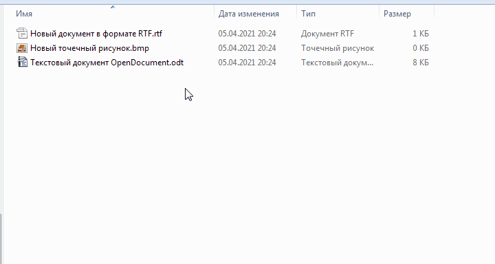

Утилита под Windows для [транслитерации](https://ru.wikipedia.org/wiki/%D0%A2%D1%80%D0%B0%D0%BD%D1%81%D0%BB%D0%B8%D1%82) кириллицы в именах файлов

# Использование:

## 1) В контекстном меню Проводника

## 2) В командной строке

`translit.exe [--dry-run] [FILE1] [FILE2] [FILE3]...`

Ключи:
 - `--dry-run` — Имитировать работу без реального переименования